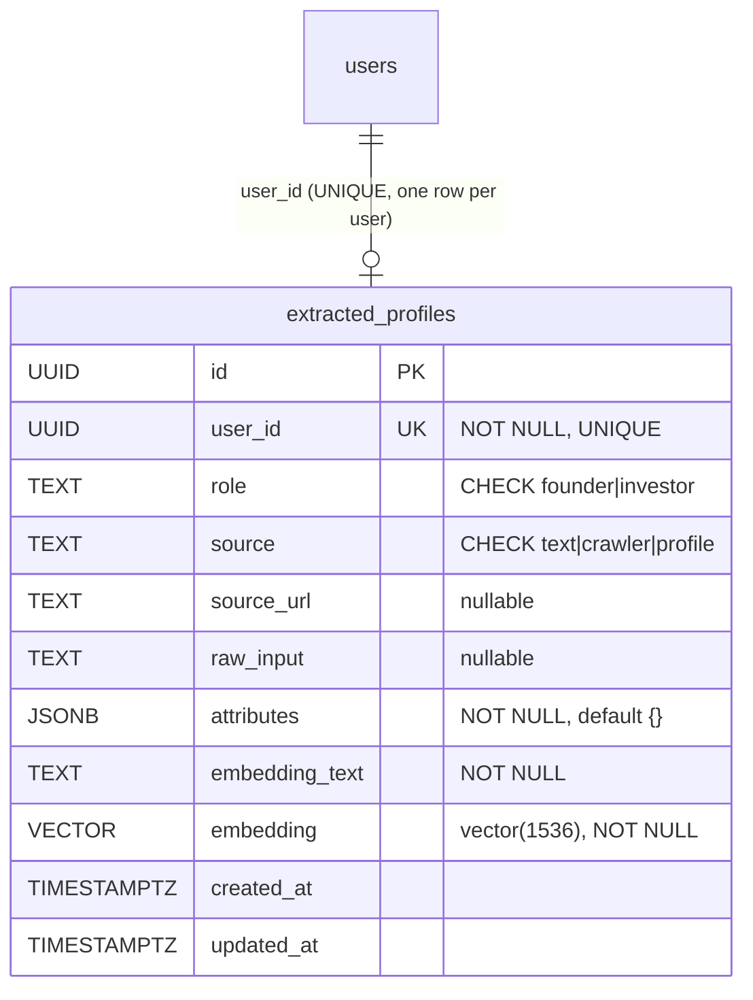

# Domain: ExtractedProfile

The `ExtractedProfile` aggregate is the AI-normalized, match-ready projection of a
user's data. It holds a role-typed structured `attributes` JSON plus a 1536-dim vector
embedding, and is the sole input to the [Match](match.md) read-model. It is owned by the
extract agent, not the gateway, and lives in its own table.

**Source of truth:** `backend/agent/extract/src/db/schema.sql`,
`backend/agent/extract/src/routes/extract.routes.js`,
`backend/agent/extract/src/services/{extraction,embedding,store,profileSource}.service.js`,
`backend/agent/extract/src/schemas/{founder,investor}.schema.js`.

**Related use cases:**
[ExtractFromText](../../use_cases/domain/extracted-profile/extract-from-text.md) ·
[ExtractFromCrawl](../../use_cases/domain/extracted-profile/extract-from-crawl.md) ·
[ExtractFromProfile](../../use_cases/domain/extracted-profile/extract-from-profile.md) ·
[GetExtractedProfile](../../use_cases/domain/extracted-profile/get-extracted-profile.md)

---

## ER diagram



Indexes: btree on `role`; **HNSW** on `embedding` using `vector_cosine_ops` (cosine).

---

## Attributes

| Attribute        | Type          | Nullable | Notes |
|------------------|---------------|----------|-------|
| `id`             | UUID          | no       | PK, `gen_random_uuid()`. |
| `user_id`        | UUID          | no       | **UNIQUE** — one extracted profile per user. |
| `role`           | text          | no       | `CHECK IN ('founder','investor')`. |
| `source`         | text          | no       | `CHECK IN ('text','crawler','profile')` — how this record was produced. |
| `source_url`     | text          | yes      | Set for the `crawler` source. |
| `raw_input`      | text          | yes      | Original text/content the extraction ran on (null for the `profile` source). |
| `attributes`     | jsonb         | no       | Default `{}`. Role-typed structured attributes (shape below). |
| `embedding_text` | text          | no       | Human-readable string built from `attributes`, fed to the embedder. |
| `embedding`      | vector(1536)  | no       | Cosine-indexed vector for similarity search. |
| `created_at`     | timestamptz   | no       | Default `now()`. |
| `updated_at`     | timestamptz   | no       | Default `now()`; bumped on upsert conflict. |

### `attributes` shape — founder (`founder_profile` schema)

| Field | Type | Notes |
|-------|------|-------|
| `company_name` | string \| null | |
| `industry` | string[] | lowercase sectors |
| `stage` | enum \| null | `pre-seed`, `seed`, `series-a`, `series-b`, `growth` |
| `country` | string \| null | |
| `target_regions` | string[] | lowercase regions |
| `team_size` | int \| null | |
| `arr_usd` | number \| null | |
| `funding_ask_usd` | number \| null | drives check-size fit |
| `business_model` | enum \| null | `b2b`, `b2c`, `b2b2c`, `marketplace` |
| `product_description` | string \| null | |
| `traction_summary` | string \| null | |

### `attributes` shape — investor (`investor_profile` schema)

| Field | Type | Notes |
|-------|------|-------|
| `firm_name` | string \| null | |
| `investor_type` | enum \| null | `vc`, `angel`, `cvc`, `pe`, `family-office` |
| `thesis` | string \| null | |
| `sectors` | string[] | lowercase |
| `stages` | string[] | |
| `geographies` | string[] | lowercase (`global` is special-cased in scoring) |
| `check_size_min_usd` | number \| null | |
| `check_size_max_usd` | number \| null | |
| `portfolio_highlights` | string[] | |
| `constraints` | string \| null | |

---

## Commands

All three extraction commands run the same pipeline and end with an **upsert keyed on
`user_id`**:

```
extractAttributes(role, text)   → LLM, json_schema-constrained (text/crawl sources)
  │                                (profile source maps DB row → attributes instead)
buildEmbeddingText(role, attrs) → deterministic string
embed(embeddingText)            → 1536-dim vector (OpenAI, or local hash fallback)
upsertExtractedProfile(...)     → INSERT ... ON CONFLICT (user_id) DO UPDATE
```

### ExtractFromText — `POST /extract/text`
Inputs: `{ userId, role, text }`. Validates all three present (400) and `role ∈
{founder, investor}` (400). Source = `text`, `raw_input = text`. → 201.
See [extract-text.md](../../use_cases/domain/extracted-profile/extract-from-text.md).

### ExtractFromCrawl — `POST /extract/crawl`
Inputs: `{ userId, role, url, content, metadata? }`. Validates `userId, role, url,
content` (400) and role (400). Extracts from `content`, then shallow-merges optional
`metadata` over the extracted attributes. Source = `crawler`, `source_url = url`,
`raw_input = content`. → 201.
See [extract-crawl.md](../../use_cases/domain/extracted-profile/extract-from-crawl.md).

### ExtractFromProfile — `POST /extract/profile`
Inputs: `{ userId }`. Loads the user's [Profile](profile.md) joined to the user
(`404 User has no profile` if absent), maps columns → role-typed `attributes` via
`mapProfileToAttributes`, and runs the pipeline. Source = `profile`, no `raw_input`.
**This is the endpoint the gateway calls on ProfileCreated / ProfileUpdated.** → 201.
See [extract-profile.md](../../use_cases/domain/extracted-profile/extract-from-profile.md).

### GetExtractedProfile — `GET /extracted/:userId`
Returns the stored record (without `embedding`/`raw_input` — the select omits them),
or **404 No extracted profile for user**.

---

## Domain events

| Event              | Raised by                | Consequence |
|--------------------|--------------------------|-------------|
| `ProfileExtracted` | any Extract* command     | The user now has a match-ready `attributes` + `embedding`. Makes the user eligible to appear in, and to request, [Match](match.md) results. On re-extraction the same row is updated in place (`updated_at` bumped). |

Upstream, `ProfileExtracted` is caused by `ProfileCreated` / `ProfileUpdated` from the
[Profile](profile.md) domain (the gateway's `triggerExtraction`).

---

## Business rules / invariants

1. **One extracted profile per user** — `user_id` is `UNIQUE`; all commands upsert with
   `ON CONFLICT (user_id) DO UPDATE`, so re-running extraction replaces the row.
2. **Role is `founder` or `investor`** — DB `CHECK` and route-level validation. No
   `admin` extracted profiles (admins are dashboard operators, not match participants).
3. **Source is one of `text`, `crawler`, `profile`** — DB `CHECK`.
4. **`attributes`, `embedding_text`, and `embedding` are always present** — NOT NULL;
   `embedding` is exactly 1536 dimensions.
5. **Embedding has a keyless fallback** — without `OPENAI_API_KEY` the service uses a
   local feature-hash embedding (lexical, not semantic) so the pipeline stays functional.
6. **Attributes are normalized at extraction** — lowercase sectors/regions, stages
   constrained to the five-value enum, monetary values as USD numbers.
7. **`embedding_text` is derived deterministically** from `attributes`, so equal
   attributes yield equal embedding text.
