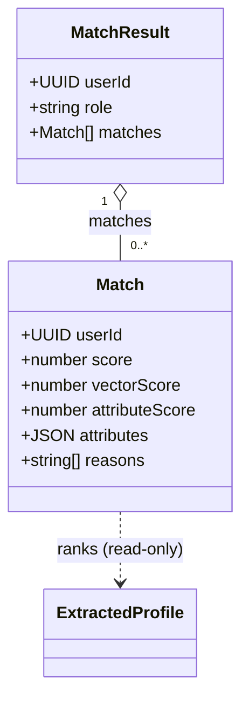

# Domain: Match (computed read-model)

`Match` is **not a persisted aggregate**. It is a computed read-model: the matching
engine ranks other users' [ExtractedProfile](extracted-profile.md) rows against the
requester's, on demand, and returns the ranked list. Nothing about a match is ever
written back to the database.

**Source of truth:** `backend/matching-engine/src/services/matching.service.js`,
`backend/matching-engine/src/services/scoring.js`,
`backend/matching-engine/src/routes/match.routes.js`.

**Related use cases:**
[FindMatches](../../use_cases/domain/matching/find-matches.md)

---

## Shape

A `Match` element carries the candidate's `userId`, the composite `score`, its
`vectorScore` and `attributeScore` components, the candidate's raw `attributes`, and
human-readable `reasons` explaining the attribute contribution.

---

## Command

### FindMatches
Inputs: `{ userId, targetRole, limit, filters }` where
`filters = { sector?, stage?, region? }`.

Routes (matching-engine):
- `GET /matches/founders/:userId/investors` → `targetRole = 'investor'`
- `GET /matches/investors/:userId/founders` → `targetRole = 'founder'`
- `GET /matches` (bare) → **proxied to the Python matching API** (`MATCHING_API_URL`);
  not computed by this service.

Algorithm:

1. Load the requester's `role`, `attributes`, `embedding` from `extracted_profiles`.
   **404** `No extracted profile for user; run extraction first` if absent.
2. Build a candidate query over `extracted_profiles` where
   `role = targetRole` and `user_id <> requester`, plus any supplied filters:
   - `sector` / `region` → JSONB array containment (`attributes->'<key>' ? $n`)
   - `stage` → array containment for investors, scalar equality (`->>`) for founders
   - filter keys are role-relative (`sectors`/`stages`/`geographies` for an investor
     target, `industry`/`stage`/`target_regions` for a founder target)
3. Order candidates by cosine distance to the requester's embedding, take the top
   **`CANDIDATE_POOL` (50)**.
4. For each candidate compute:
   - `vectorScore = 1 - (embedding <=> me.embedding)` (cosine similarity)
   - `attributeScore, reasons = scoreMatch(...)` (below)
   - `score = round(0.7·vectorScore + 0.3·attributeScore, 4)`
5. Sort by `score` desc and slice to `limit`.

Returns `{ userId, role, matches[] }`. See
[find-matches.md](../../use_cases/domain/matching/find-matches.md).

---

## Scoring

### Composite (`matching.service.js`)

| Component        | Weight | Env override            |
|------------------|--------|-------------------------|
| `vectorScore`    | 0.7    | `MATCH_VECTOR_WEIGHT`   |
| `attributeScore` | 0.3    | `MATCH_ATTR_WEIGHT`     |

`CANDIDATE_POOL` (50) is overridable via `MATCH_CANDIDATE_POOL`.

### Attribute score (`scoring.js`)

Always evaluated as **founder attributes vs investor attributes**, regardless of who
requested (`scoreMatch` orients the pair by the requester's role).

| Signal          | Contribution | Rule |
|-----------------|--------------|------|
| Sector overlap  | `0.4 × jaccard` | Jaccard of founder `industry` ∩ investor `sectors` (lowercased). |
| Stage match     | `+0.3` (flat) | Founder `stage` is in investor `stages`. |
| Geography       | `+0.2` (flat) | Investor `geographies` contains `global` (and founder has any region), **or** any overlap between founder `target_regions` and investor `geographies`. |
| Check-size fit  | `+0.1` or `+0.05` | Founder `funding_ask_usd` within investor `[check_size_min_usd, check_size_max_usd]`. `+0.1` when both bounds exist, `+0.05` when only one bound exists. |

Final `attributeScore = min(sum, 1.0)` — **capped at 1.0**. Each firing signal appends a
string to `reasons`.

---

## Domain events

None. FindMatches is a pure read; it raises no events and mutates no state.

---

## Business rules / invariants

1. **Match is never persisted.** The matching engine only reads `extracted_profiles`;
   it writes nothing. Any durable ranked list (`GET /matches`) is owned by the separate
   Python matching API, not this domain.
2. **Requester must have an extracted profile** — otherwise 404 (extraction must run
   first).
3. **Candidates exclude the requester** (`user_id <> requester`) and must match
   `targetRole`.
4. **Candidate pool is capped at 50** (vector-nearest), then re-ranked by the composite
   score.
5. **`limit` is clamped to `[1, 50]`**, default `10` (`parseLimit`).
6. **Composite weighting is 0.7 vector + 0.3 attribute**; attribute weighting is
   0.4 sector / 0.3 stage / 0.2 geography / 0.1 check-size, attribute total capped at 1.0.
7. **Filters are role-relative** and matched against the JSONB `attributes` of the
   candidate side.
