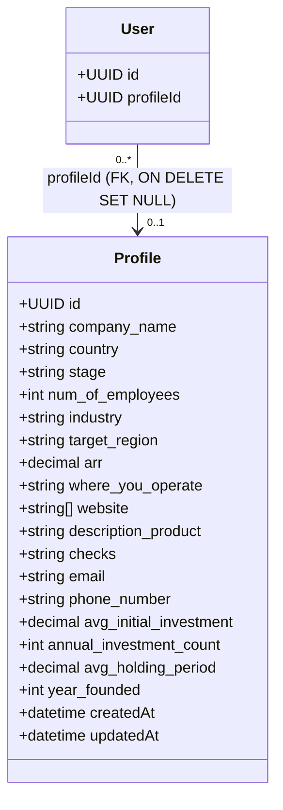

# Domain: Profile

The `Profile` aggregate holds the user-entered business profile — company / firm
details for both founders and investors in a single wide table. Creating or updating a
profile is the trigger for the [ExtractedProfile](extracted-profile.md) pipeline.

**Source of truth:** `backend/gateway/src/models/profile.model.js`,
`backend/gateway/src/services/profile.service.js`.

**Related use cases:**
[CreateProfile](../../use_cases/domain/profile/create-profile.md) ·
[UpdateProfile](../../use_cases/domain/profile/update-profile.md) ·
[GetProfile](../../use_cases/domain/profile/get-profile.md)

---

## Class / ER diagram

The profile is a shared shape for both roles. Founder-relevant columns (`stage`,
`num_of_employees`, `arr`, `checks` as funding ask) and investor-relevant columns
(`avg_initial_investment`, `annual_investment_count`, `avg_holding_period`) coexist;
which ones carry meaning depends on the owning [User](user.md)'s `role`.

---

## Attributes

| Attribute                | Type              | Nullable | Notes |
|--------------------------|-------------------|----------|-------|
| `id`                     | UUID (v4)         | no       | Primary key. |
| `company_name`           | string            | **no**   | Only required field. Company / firm name. |
| `country`                | string            | yes      | |
| `stage`                  | string            | yes      | Free text here; normalized during extraction. |
| `num_of_employees`       | integer           | yes      | |
| `industry`               | string            | yes      | Comma-separated in practice; split to a list during extraction. |
| `target_region`          | string            | yes      | |
| `arr`                    | decimal(18,2)     | yes      | Annual recurring revenue (founder). |
| `where_you_operate`      | string            | yes      | Fallback for regions when `target_region` is empty. |
| `website`                | string[] (ARRAY)  | yes      | Defaults to `[]`. |
| `description_product`    | string            | yes      | Product description / investment thesis. |
| `checks`                 | string            | yes      | Founder funding ask (parsed to a number during extraction). |
| `email`                  | string            | yes      | |
| `phone_number`           | string            | yes      | |
| `avg_initial_investment` | decimal(18,2)     | yes      | Investor check size (maps to `check_size_max_usd`). |
| `annual_investment_count`| integer           | yes      | |
| `avg_holding_period`     | decimal(5,2)      | yes      | |
| `year_founded`           | integer           | yes      | |
| `createdAt`              | datetime          | no       | Column `created_at`. |
| `updatedAt`              | datetime          | no       | Column `updated_at`. |

Table `profiles`, `underscored: true`, `timestamps: true`.

---

## Commands

### CreateProfile
Inputs: `userId`, `data` (profile fields)

1. Load the user; **404 User not found** if missing.
2. If `user.profileId` is already set → **409 User already has a profile**.
3. Create the profile, set `user.profileId = profile.id`, save the user.
4. Fire-and-forget `triggerExtraction(userId)` → `POST {EXTRACT_SERVICE_URL}/extract/profile`.
5. Return the created profile.

See [create.md](../../use_cases/domain/profile/create-profile.md).

### UpdateProfile
Inputs: `userId`, `profileId`, `data`

1. Load the user; if the user is missing **or** `user.profileId !== profileId` →
   **403 Forbidden** (ownership check).
2. Load the profile; **404 Profile not found** if missing.
3. Apply the update.
4. Fire-and-forget `triggerExtraction(userId)`.
5. Return the updated profile.

See [update.md](../../use_cases/domain/profile/update-profile.md).

### GetProfile
Inputs: `profileId` → returns the profile, or **404 Profile not found**.

---

## Domain events

| Event            | Raised by      | Consequence |
|------------------|----------------|-------------|
| `ProfileCreated` | CreateProfile  | Links the profile to its user and **triggers extraction** (`POST /extract/profile`). Kicks off the [ExtractedProfile](extracted-profile.md) pipeline. |
| `ProfileUpdated` | UpdateProfile  | **Triggers re-extraction** so the extracted attributes and embedding stay in sync with the edited profile. |

`triggerExtraction` is best-effort: it returns immediately if `EXTRACT_SERVICE_URL`
is unset and swallows/logs any error, so extraction never blocks or fails the write.

---

## Business rules / invariants

1. **One profile per user** — enforced in `createProfile` via the `user.profileId`
   null-check (409 on a second attempt), not by a DB unique constraint on the FK.
2. **`company_name` is required**; every other field is optional/nullable.
3. **Update only by the owner** — a user may update a profile only when
   `user.profileId === profileId`, otherwise 403. There is no cross-user edit path.
4. **Create and update both trigger (re-)extraction** for the owning user.
5. **Extraction is non-blocking** — a failed or unconfigured extract call does not fail
   the profile write.
6. **`website` defaults to `[]`** rather than null.
