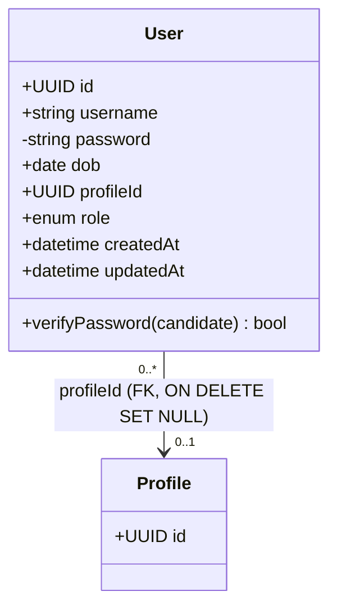

# Domain: User

The `User` aggregate is the identity and authentication root. It owns credentials,
the account role, and a nullable reference to the account's business `Profile`.
It is the only aggregate that participates in authentication (JWT issuance).

**Source of truth:** `backend/gateway/src/models/user.model.js`,
`backend/gateway/src/services/auth.service.js`.

**Related use cases:**
[RegisterUser](../../use_cases/domain/user/register.md) ·
[LoginUser](../../use_cases/domain/user/login.md)

---

## Class / ER diagram

`Profile.hasMany(User)` / `User.belongsTo(Profile)` — the FK lives on `users.profile_id`.
In practice the [Profile domain](profile.md) enforces one profile per user, so the
association is effectively 1:1, but the schema itself permits many users to point at
one profile.

---

## Attributes

| Attribute   | Type                              | Nullable | Notes |
|-------------|-----------------------------------|----------|-------|
| `id`        | UUID (v4)                         | no       | Primary key, auto-generated. |
| `username`  | string                            | no       | **Unique.** Login identifier. |
| `password`  | string (bcrypt hash)              | no       | Hashed with bcrypt, `SALT_ROUNDS = 10`, on create and on password change. Excluded by the default query scope; only readable via the `withPassword` scope. Never returned to clients. |
| `dob`       | date (`DATEONLY`)                 | yes      | Date of birth, no time component. |
| `profileId` | UUID                              | yes      | Column `profile_id`. FK → `profiles.id` **ON DELETE SET NULL**. Null until the user creates a profile. |
| `role`      | enum `enum_users_role`            | no       | Postgres enum. Values: `founder`, `investor`, `admin`. See rules below. |
| `createdAt` | datetime                          | no       | Column `created_at`. |
| `updatedAt` | datetime                          | no       | Column `updated_at`. |

Table `users`, `underscored: true`, `timestamps: true`.

---

## Commands

### RegisterUser
Inputs: `{ username, password, dob?, role, profileId? }`

1. Reject if `username` already exists → **409 Username already taken**.
2. Create the user; the `beforeCreate` hook hashes the password.
3. Issue a JWT and return `{ user (sanitized, no password), token }`.

See [register.md](../../use_cases/domain/user/register.md).

### LoginUser
Inputs: `{ username, password }`

1. Load the user **with password** (`withPassword` scope).
2. If not found **or** `verifyPassword` fails → **401 Invalid credentials**
   (same error for both, to avoid user enumeration).
3. Issue a JWT and return `{ user (sanitized), token }`.

See [login.md](../../use_cases/domain/user/login.md).

### (Out of band) GrantAdmin
Not an application command. The `admin` role is assigned **only by a direct database
update** (e.g. `UPDATE users SET role='admin' WHERE ...`). There is no API path that
sets or upgrades a role to `admin`. Admin grants access to the ai-data-platform dashboard.

---

## JWT / token contract

Issued by `issueToken(user)`:

| Claim      | Source          |
|------------|-----------------|
| `sub`      | `user.id`       |
| `username` | `user.username` |
| `role`     | `user.role`     |

Signed with `JWT_SECRET`, `expiresIn = JWT_EXPIRES_IN` (default `1d`). Downstream
services (including the dashboard admin gate) authorize off the `role` claim.

---

## Domain events

| Event            | Raised by      | Consequence |
|------------------|----------------|-------------|
| `UserRegistered` | RegisterUser   | New identity exists; a JWT is issued. No profile yet (`profileId` null). |
| `UserLoggedIn`   | LoginUser      | A fresh JWT is issued. |

No event triggers extraction directly — extraction is driven by the
[Profile](profile.md) lifecycle, not the User lifecycle.

---

## Business rules / invariants

1. **Unique username** — enforced at the column level and re-checked in `register`
   (returns 409 rather than a raw constraint error).
2. **Password is never stored or returned in plaintext** — bcrypt hash only, excluded
   from the default scope, stripped by `sanitize()` before any response.
3. **Registration role is limited to `founder` or `investor`.** The register path must
   reject `admin`. `admin` is reachable **only via a direct DB update**, never through
   register or any API.
4. **`admin` grants dashboard access** — the ai-data-platform dashboard is gated on the
   `admin` role carried in the JWT.
5. **`profileId` is nullable and set-null on profile deletion** — a user can exist
   without a profile; deleting the profile does not delete the user.
6. **Login errors are indistinguishable** — unknown username and wrong password both
   return 401 with the same message.
