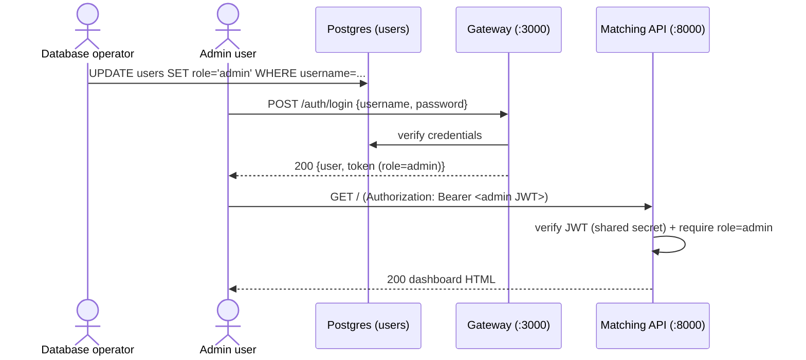

# BUC-ADMIN — Admin Dashboard Access

> **Type:** Business Use Case (BUC)
> **System:** VietNexus rebuilt backend (FastAPI port) + ai-data-platform matching API
> **Status:** NEW requirement for the rebuild — not present in the current Node behavior.
> **Scope:** Provisioning of the privileged `admin` role (database-only) and gating the
> operational dashboard behind an admin JWT.

## 1. Summary

The platform introduces a third user role, `admin`, that grants access to the operational
dashboard served by the ai-data-platform matching API (`GET /` on port 8000). Unlike
`founder` and `investor`, the `admin` role can **never** be created through the public
registration endpoint. Admin users exist only when a database operator promotes an existing
user directly in the database. An admin authenticates through the normal login flow and
receives a JWT whose `role` claim is `admin`; that token unlocks the dashboard. All non-admin
or unauthenticated callers are rejected. The data (JSON) endpoints of the matching API remain
public and unauthenticated.

## 2. Actors

| Actor | Description |
|-------|-------------|
| **Database operator (DBA)** | Human with direct database access who promotes a user to `admin`. Not an API client. |
| **Admin user** | A promoted user who logs in and views the operational dashboard. |
| **Gateway service** | FastAPI service (port 3000) — issues the JWT via *Login*; the JWT carries the `role` claim. |
| **Matching API (ai-data-platform)** | FastAPI service (port 8000) — serves the dashboard HTML at `GET /` and read-only JSON endpoints. |

## 3. Preconditions

- The `users` table role domain permits the value `admin` at the database layer (see BR1).
- The gateway and the matching API share the same `JWT_SECRET` (HS256) so the matching API
  can verify tokens the gateway issued.
- A user account already exists (created via *Register* as `founder` or `investor`) before it
  can be promoted.

## 4. Main Flow (happy path)

**Steps:**

1. **Provision (DB-only).** The database operator promotes an existing user:
   `UPDATE users SET role='admin' WHERE username = '<name>';`. There is no API path that
   produces an admin — see [`../domain/user/register.md`](../domain/user/register.md) BR/EF.
2. **Authenticate.** The admin logs in via the standard *Login* DUC and receives a JWT whose
   `role` claim is `admin`. Login itself is role-agnostic — see
   [`../domain/user/login.md`](../domain/user/login.md).
3. **Access dashboard.** The admin calls `GET /` on the matching API with the bearer token.
   The API verifies the token against the shared secret and checks `role == "admin"`, then
   returns the dashboard HTML.

## 5. Alternative Flows

- **AF1 — Demotion.** A DBA sets a user's role back to `founder`/`investor` via a database
  update. Tokens minted while the user was admin remain valid until expiry (JWT is stateless);
  new logins produce a non-admin token that is refused by the dashboard.
- **AF2 — Public data access.** Any caller (no token required) may still call the read-only
  JSON endpoints (`/entities`, `/matches`, `/sagas`, `/jobs`, `/events`, `/workers`,
  `/metrics`, `/costs`, `POST /runs`); only `GET /` (the dashboard shell) is gated. See BR4.

## 6. Exception Flows

- **EF1 — Missing/invalid Authorization header.** `GET /` with no bearer token →
  `401 {"error": "Missing or invalid Authorization header"}`.
- **EF2 — Invalid or expired token.** `GET /` with a malformed/expired/wrong-secret token →
  `401 {"error": "Invalid or expired token"}`.
- **EF3 — Authenticated but not admin.** `GET /` with a valid `founder`/`investor` token →
  `403 {"error": "Forbidden"}`.
- **EF4 — Admin created via API is impossible.** Any attempt to register with `role=admin` is
  rejected at the gateway before an account is created (documented in *Register* EF/BR).

## 7. Business Rules

- **BR1 — Admin is database-provisioned only.** The only way to obtain `role='admin'` is a
  direct database update. The registration endpoint accepts `founder`|`investor` exclusively;
  the rebuilt schema must widen the `users.role` domain to include `admin` while the API
  validation layer continues to reject it on input.
- **BR2 — Same token, elevated claim.** Admins use the identical login flow and JWT format as
  other users; only the `role` claim differs (`admin`). No separate admin login endpoint.
- **BR3 — Dashboard requires role=admin.** `GET /` on the matching API is protected: verify
  the HS256 JWT with the shared `JWT_SECRET`, then require `role == "admin"`. The
  401/403 semantics mirror the gateway's `authenticate` + `authorize` middleware exactly.
- **BR4 — Data endpoints stay public.** Only the dashboard shell (`GET /`) is gated. The JSON
  read endpoints and `POST /runs` remain unauthenticated, preserving current behavior.

## 8. Acceptance Criteria

- **AC1** `POST /auth/register` with `role=admin` is rejected (never creates an admin account)
  — cross-checked in *Register* AC/EF.
- **AC2** A user promoted via `UPDATE users SET role='admin'` receives a JWT with `role=admin`
  on the next login.
- **AC3** `GET /` on the matching API with a valid admin JWT returns 200 and the dashboard HTML.
- **AC4** `GET /` with no token returns 401 (EF1); with a non-admin token returns 403 (EF3);
  with an invalid/expired token returns 401 (EF2).
- **AC5** A JSON data endpoint (e.g. `GET /entities`) returns 200 without any token (BR4).

## 9. Cross-References

- Provisioning constraint: [Register — DUC-USER-REGISTER](../domain/user/register.md) (BR: admin
  never via API).
- Token issuance: [Login — DUC-USER-LOGIN](../domain/user/login.md).
- Token verification pattern reused from: [Get current user — DUC-USER-ME](../domain/user/get-current-user.md).
- End-user counterpart journey: [BUC-MATCHING](startup-investor-matching.md).
