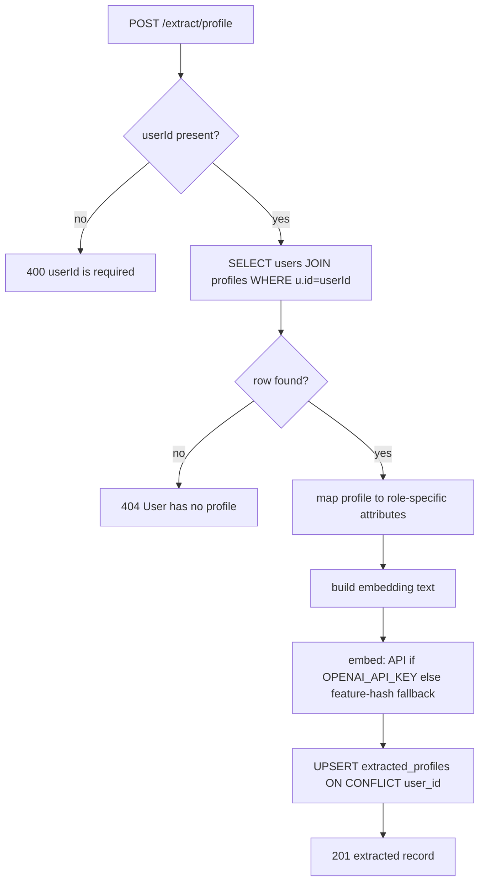

# DUC-EXTRACT-PROFILE — Extract From Profile

> **Type:** Domain Use Case (DUC)
> **Service:** Extract agent (FastAPI port), port 3003
> **Endpoint:** `POST /extract/profile`
> **Source of truth:** `backend/agent/extract/src/routes/extract.routes.js`,
> `backend/agent/extract/src/services/profileSource.service.js`,
> `backend/agent/extract/src/services/embedding.service.js`,
> `backend/agent/extract/src/services/store.service.js`
> **Realizes:** [BUC-MATCHING](../../business/startup-investor-matching.md) (step 3 — auto-extraction).
> This is the endpoint the gateway fires from [Create profile](../profile/create-profile.md) and
> [Update profile](../profile/update-profile.md).

## 1. Description

Derives an `extracted_profiles` row for a user **deterministically** from their stored
`profiles` row (no LLM). Maps the profile to role-specific attributes, builds an embedding
text, embeds it, and upserts the row keyed by `user_id`.

## 2. Actors

- **Gateway service** (fire-and-forget caller) or any operator.
- **Extract agent**, **Postgres** (`users`, `profiles`, `extracted_profiles`).

## 3. Preconditions

- The user exists and has a linked profile (BR1 / EF2).

## 4. Request

`POST /extract/profile`, JSON body:

| Field | Type | Required |
|-------|------|----------|
| `userId` | string (uuid) | yes |

## 5. Main Flow



1. Validate `userId` is present.
2. Join `users` and `profiles` on `users.profile_id`; if no row, `404`.
3. Map the profile to attributes for `row.role`:
   - **Founder:** `company_name, industry[], stage, country, target_regions[], team_size,
     arr_usd, funding_ask_usd, business_model(null), product_description, traction_summary(null)`.
     Lists come from comma-splitting `industry`; regions from `target_region` (fallback
     `where_you_operate`); `stage` lowercased with `_`→`-`; `funding_ask_usd` parsed from `checks`.
   - **Investor:** `firm_name(company_name), investor_type(null), thesis(description_product),
     sectors[], stages[], geographies[], check_size_min_usd(null),
     check_size_max_usd(avg_initial_investment), portfolio_highlights[], constraints(null)`.
4. Build the embedding text (role-specific concatenation of salient fields) and embed it.
   With `OPENAI_API_KEY` set, uses the embedding model; otherwise a deterministic feature-hash
   fallback (lexical similarity — see BR3).
5. Upsert `extracted_profiles` on the unique `user_id` (source `"profile"`).
6. Return `201` with the stored record.

**Success response — 201** (record columns):
```json
{ "id": "<uuid>", "user_id": "<uuid>", "role": "founder", "source": "profile",
  "source_url": null, "attributes": { ... }, "embedding_text": "...",
  "created_at": "...", "updated_at": "..." }
```

## 6. Alternative Flows

- **AF1 — Re-extraction:** Called again for the same user (e.g. after a profile edit), the
  upsert overwrites the existing row (BR2).

## 7. Exception Flows

- **EF1** Missing `userId` → `400 {"error": "userId is required"}`.
- **EF2** User has no linked profile (join yields no row) → `404 {"error": "User has no profile"}`.

## 8. Business Rules

- **BR1** Extraction from profile is **deterministic** — it maps stored profile columns to
  attributes and does **not** call the chat model, so it works without `OPENAI_API_KEY`.
- **BR2** `extracted_profiles` is upserted on the unique `user_id`; re-running replaces role,
  source, attributes, embedding text/vector, and bumps `updated_at`.
- **BR3** Embeddings use the OpenAI-compatible API when `OPENAI_API_KEY` is set; otherwise the
  L2-normalized feature-hash fallback (`EMBEDDING_DIM` = 1536) keeps the pipeline functional.
- **BR4** The response omits `raw_input` and `embedding` (vector); it returns the projection
  listed in §5.

## 9. Acceptance Criteria

- **AC1** For a user with a linked founder profile, returns `201` with `source: "profile"`,
  `role: "founder"`, and founder-shaped `attributes`.
- **AC2** For a linked investor profile, returns `201` with investor-shaped `attributes`
  (`firm_name`, `sectors`, `check_size_max_usd` from `avg_initial_investment`, etc.).
- **AC3** Missing `userId` returns EF1's exact 400 payload.
- **AC4** A user without a profile returns EF2's exact 404 payload.
- **AC5** Extraction succeeds with `OPENAI_API_KEY` unset (feature-hash fallback), producing a
  row that [Find matches](../matching/find-matches.md) can rank.
- **AC6** A second call for the same user overwrites (not duplicates) the row (unique `user_id`).

## 10. Cross-References

- Triggered by: [Create profile](../profile/create-profile.md), [Update profile](../profile/update-profile.md).
- Read via: [Get extracted profile](get-extracted-profile.md).
- Consumed by: [Find matches](../matching/find-matches.md).
- Alternatives that use the LLM: [Extract from text](extract-from-text.md),
  [Extract from crawl](extract-from-crawl.md).
