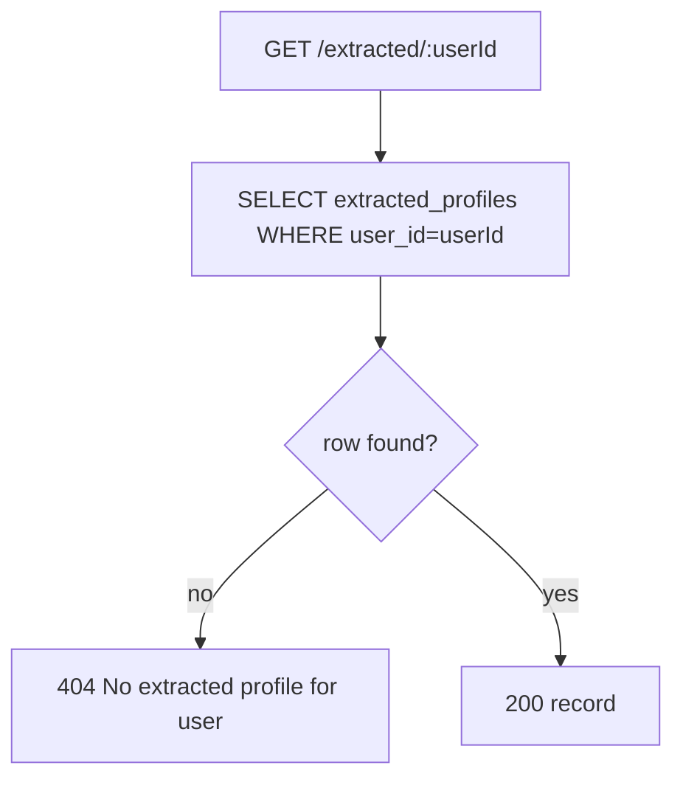

# DUC-EXTRACT-GET — Get Extracted Profile

> **Type:** Domain Use Case (DUC)
> **Service:** Extract agent (FastAPI port), port 3003
> **Endpoint:** `GET /extracted/{userId}`
> **Source of truth:** `backend/agent/extract/src/routes/extract.routes.js`,
> `backend/agent/extract/src/services/store.service.js`
> **Realizes:** [BUC-MATCHING](../../business/startup-investor-matching.md) (AF4 — inspect extraction)

## 1. Description

Returns the stored `extracted_profiles` row for a user (the projection without `raw_input` and
the raw embedding vector).

## 2. Actors

- **Operator / integration** (unauthenticated service endpoint).
- **Extract agent**, **Postgres** (`extracted_profiles`).

## 3. Preconditions

- An extracted row exists for the user (otherwise EF1).

## 4. Request

`GET /extracted/{userId}` — `userId` is the path param.

## 5. Main Flow



1. Query `extracted_profiles` by `user_id`.
2. If none, `404`; otherwise return `200` with the record.

**Success response — 200** (projection):
```json
{ "id": "<uuid>", "user_id": "<uuid>", "role": "founder", "source": "profile",
  "source_url": null, "attributes": { ... }, "embedding_text": "...",
  "created_at": "...", "updated_at": "..." }
```

## 6. Alternative Flows

_None._

## 7. Exception Flows

- **EF1** No extracted row for `userId` → `404 {"error": "No extracted profile for user"}`.

## 8. Business Rules

- **BR1** Returns the projection `id, user_id, role, source, source_url, attributes,
  embedding_text, created_at, updated_at`. The `raw_input` text and the raw `embedding` vector
  are **not** returned.
- **BR2** One row per user (unique `user_id`), so at most one record is returned.

## 9. Acceptance Criteria

- **AC1** For a user with an extracted profile, returns `200` with the §5 projection and no
  `raw_input`/`embedding` fields.
- **AC2** For a user without one, returns EF1's exact 404 payload.

## 10. Cross-References

- Produced by: [Extract from profile](extract-from-profile.md), [Extract from text](extract-from-text.md),
  [Extract from crawl](extract-from-crawl.md).
- Same 404-when-absent condition drives matching's EF1 in [Find matches](../matching/find-matches.md).
