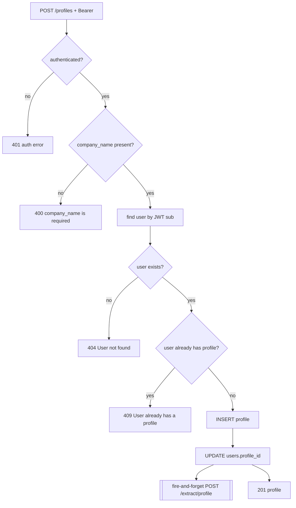

# DUC-PROFILE-CREATE — Create Profile

> **Type:** Domain Use Case (DUC)
> **Service:** Gateway (FastAPI port), port 3000
> **Endpoint:** `POST /profiles` (authenticated)
> **Source of truth:** `backend/gateway/src/routes/profile.routes.js`,
> `backend/gateway/src/services/profile.service.js`, `backend/gateway/src/models/profile.model.js`
> **Realizes:** [BUC-MATCHING](../../business/startup-investor-matching.md) (step 2 + extraction trigger)

## 1. Description

Creates the calling user's single profile, links it to the user, and fires a background
(fire-and-forget) extraction trigger to the extract agent.

## 2. Actors

- **Authenticated user** (`founder`|`investor`).
- **Gateway service**, **Extract agent** (async trigger), **Postgres** (`users`, `profiles`).

## 3. Preconditions

- Valid JWT (router applies `authenticate` to all `/profiles` routes).
- The user does not already have a linked profile (BR1).

## 4. Request

`POST /profiles`, `Authorization: Bearer <jwt>`, JSON body.

- **Required:** `company_name` (string).
- **Optional (all nullable):** `country`, `stage`, `num_of_employees`, `industry`,
  `target_region`, `arr`, `where_you_operate`, `website` (string array, default `[]`),
  `description_product`, `checks`, `email`, `phone_number`, `avg_initial_investment`,
  `annual_investment_count`, `avg_holding_period`, `year_founded`.

The user is identified by the JWT `sub` claim, not by any body field.

## 5. Main Flow

1. Authenticate the request.
2. Validate `company_name` is present.
3. Load the user by JWT `sub`; reject if not found.
4. Reject if the user already has a `profile_id`.
5. Insert the profile, set `users.profile_id`, and save.
6. Fire a non-blocking `POST {EXTRACT_SERVICE_URL}/extract/profile {userId}` (errors logged,
   never surfaced). See [Extract from profile](../extracted-profile/extract-from-profile.md).
7. Return `201` with the created profile.

## 6. Alternative Flows

- **AF1 — `EXTRACT_SERVICE_URL` unset:** The trigger is silently skipped; the profile is still
  created and returned (BR3).

## 7. Exception Flows

- **EF1** Missing `company_name` → `400 {"error": "company_name is required"}`.
- **EF2** JWT `sub` does not resolve to a user → `404 {"error": "User not found"}`.
- **EF3** User already owns a profile → `409 {"error": "User already has a profile"}`.
- **EF0** Missing/invalid token → `401` per [authenticate](../user/get-current-user.md) (EF1/EF2 there).

## 8. Business Rules

- **BR1** A user may own at most one profile; the link is `users.profile_id`.
- **BR2** Only `company_name` is mandatory; all other columns are optional/nullable.
- **BR3** The extraction trigger is fire-and-forget: create success does not depend on it, and
  a failed or unconfigured trigger is logged, not returned as an error.
- **BR4** The owning user is derived from the token (`sub`), never from the request body.

## 9. Acceptance Criteria

- **AC1** An authenticated user with no profile and a `company_name` gets `201` with the
  profile, and `users.profile_id` is set to the new profile's id.
- **AC2** Omitting `company_name` returns EF1's exact 400 payload.
- **AC3** A second create by the same user returns EF3's exact 409 payload.
- **AC4** Creating a profile issues a `POST /extract/profile` to the extract agent when
  `EXTRACT_SERVICE_URL` is set, and the create still returns `201` regardless of the trigger's
  outcome.
- **AC5** A request without a valid token returns `401` (EF0).

## 10. Cross-References

- Triggered by success: [Extract from profile](../extracted-profile/extract-from-profile.md).
- Read/edit: [Get profile](get-profile.md), [Update profile](update-profile.md).
- Journey: [BUC-MATCHING](../../business/startup-investor-matching.md).
