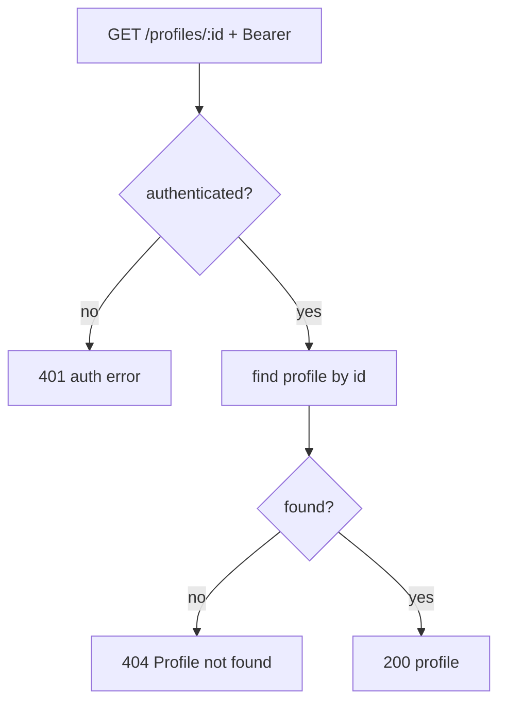

# DUC-PROFILE-GET — Get Profile

> **Type:** Domain Use Case (DUC)
> **Service:** Gateway (FastAPI port), port 3000
> **Endpoint:** `GET /profiles/{id}` (authenticated)
> **Source of truth:** `backend/gateway/src/routes/profile.routes.js`,
> `backend/gateway/src/services/profile.service.js`
> **Realizes:** [BUC-MATCHING](../../business/startup-investor-matching.md) (profile inspection)

## 1. Description

Fetches a profile by its id. Requires authentication but performs **no ownership check** — any
authenticated user may read any profile by id (behavior preserved from the Node service).

## 2. Actors

- **Authenticated user** (any role).
- **Gateway service**, **Postgres** (`profiles`).

## 3. Preconditions

- Valid JWT (`/profiles` router applies `authenticate`).

## 4. Request

`GET /profiles/{id}` with `Authorization: Bearer <jwt>`. `id` is the profile UUID path param.

## 5. Main Flow

1. Authenticate the request.
2. Load the profile by primary key.
3. If absent, return 404; otherwise return `200` with the profile.

## 6. Alternative Flows

_None._

## 7. Exception Flows

- **EF1** No profile with that id → `404 {"error": "Profile not found"}`.
- **EF0** Missing/invalid token → `401` per [authenticate](../user/get-current-user.md).

## 8. Business Rules

- **BR1** Authentication is required, but there is **no ownership restriction** on read: any
  authenticated caller can retrieve any profile by id (this is the current, intentional
  behavior to preserve).
- **BR2** The full profile record (all columns) is returned.

## 9. Acceptance Criteria

- **AC1** An authenticated request for an existing profile id returns `200` with the full
  profile.
- **AC2** An authenticated request for a non-existent id returns EF1's exact 404 payload.
- **AC3** A user can successfully read a profile they do not own (BR1).
- **AC4** A request without a valid token returns `401` (EF0).

## 10. Cross-References

- Created by: [Create profile](create-profile.md).
- Mutated by: [Update profile](update-profile.md) (which, unlike GET, enforces ownership).
