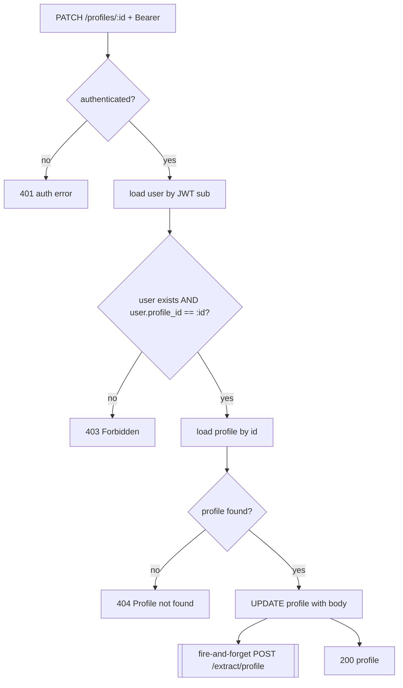

# DUC-PROFILE-UPDATE — Update Profile

> **Type:** Domain Use Case (DUC)
> **Service:** Gateway (FastAPI port), port 3000
> **Endpoint:** `PATCH /profiles/{id}` (authenticated)
> **Source of truth:** `backend/gateway/src/routes/profile.routes.js`,
> `backend/gateway/src/services/profile.service.js`
> **Realizes:** [BUC-MATCHING](../../business/startup-investor-matching.md) (AF2 — profile revision)

## 1. Description

Updates the calling user's own profile and re-fires the background extraction trigger so the
`extracted_profiles` row is refreshed.

## 2. Actors

- **Authenticated user** (the profile owner).
- **Gateway service**, **Extract agent** (async trigger), **Postgres** (`users`, `profiles`).

## 3. Preconditions

- Valid JWT; the `{id}` must equal the caller's own `profile_id` (BR1).

## 4. Request

`PATCH /profiles/{id}`, `Authorization: Bearer <jwt>`, JSON body containing any subset of the
profile fields (same columns as [Create profile](create-profile.md)). `id` is the profile UUID.

## 5. Main Flow

1. Authenticate the request.
2. Load the user by JWT `sub`. If the user is missing **or** `user.profile_id !== id`, reject
   with `403` (ownership gate — combined check, no distinction between the two causes).
3. Load the profile by id; if absent, `404`.
4. Apply the update.
5. Fire a non-blocking `POST {EXTRACT_SERVICE_URL}/extract/profile {userId}` to refresh the
   extracted profile.
6. Return `200` with the updated profile.

## 6. Alternative Flows

- **AF1 — `EXTRACT_SERVICE_URL` unset:** The refresh trigger is skipped; the update still
  succeeds.

## 7. Exception Flows

- **EF1** User missing, or `{id}` is not the caller's own `profile_id` →
  `403 {"error": "Forbidden"}`.
- **EF2** Ownership passes but the profile row is not found → `404 {"error": "Profile not found"}`.
- **EF0** Missing/invalid token → `401` per [authenticate](../user/get-current-user.md).

## 8. Business Rules

- **BR1** A user may update only their own profile: the path `{id}` must equal
  `user.profile_id`; otherwise `403` (the ownership check precedes the existence check, so a
  non-owner never learns whether the id exists).
- **BR2** Update re-fires the extraction trigger (fire-and-forget), refreshing the upserted
  `extracted_profiles` row so later matches reflect the change.
- **BR3** The update accepts a partial set of profile fields; unspecified fields are unchanged.

## 9. Acceptance Criteria

- **AC1** The owner updating their own profile gets `200` with the updated fields persisted.
- **AC2** A user updating a profile that is not their own (or any id ≠ their `profile_id`)
  returns EF1's exact 403 payload.
- **AC3** Updating fires a `POST /extract/profile` when `EXTRACT_SERVICE_URL` is set, and the
  update returns `200` regardless of the trigger outcome.
- **AC4** A request without a valid token returns `401` (EF0).

## 10. Cross-References

- Refreshes: [Extract from profile](../extracted-profile/extract-from-profile.md).
- Created by: [Create profile](create-profile.md); read by: [Get profile](get-profile.md).
- Downstream effect on: [Find matches](../matching/find-matches.md) (BUC-MATCHING AF2).
