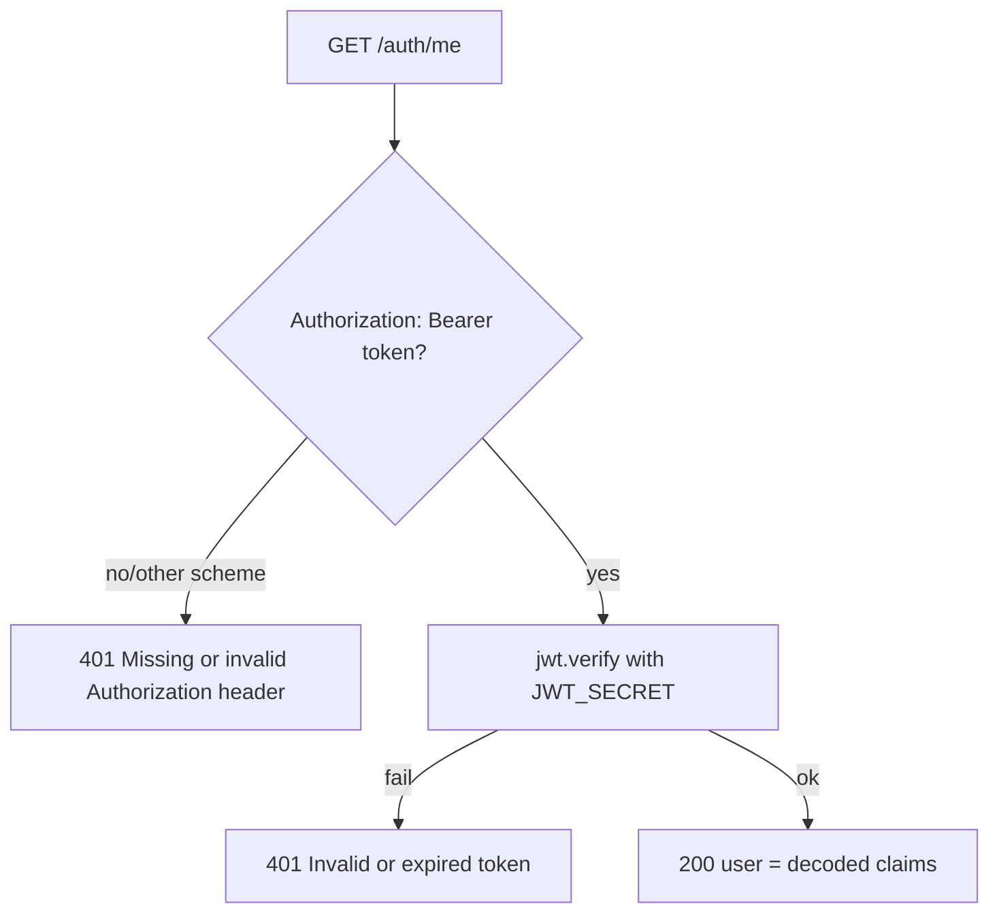

# DUC-USER-ME — Get Current User

> **Type:** Domain Use Case (DUC)
> **Service:** Gateway (FastAPI port), port 3000
> **Endpoint:** `GET /auth/me`
> **Source of truth:** `backend/gateway/src/routes/auth.routes.js`,
> `backend/gateway/src/middleware/authenticate.js`
> **Realizes:** [BUC-MATCHING](../../business/startup-investor-matching.md) (session confirmation).
> The token-verification behavior here is the reference pattern reused by the admin dashboard
> gate in [BUC-ADMIN](../../business/admin-dashboard-access.md).

## 1. Description

Returns the decoded JWT claims for the currently authenticated user. This is a pure
token-echo endpoint — it does not read the database.

## 2. Actors

- **Authenticated user** (any role).
- **Gateway service** (`authenticate` middleware).

## 3. Preconditions

- Caller holds a valid, unexpired JWT issued by the gateway.

## 4. Request

`GET /auth/me` with header `Authorization: Bearer <jwt>`.

## 5. Main Flow



1. `authenticate` middleware parses the `Authorization` header; the scheme must be `Bearer`
   and a token must be present.
2. Verify the token with `JWT_SECRET`.
3. On success, attach the decoded claims to the request and return them.

**Success response — 200:**
```json
{ "user": { "sub": "<uuid>", "username": "...", "role": "founder",
            "iat": 1700000000, "exp": 1700086400 } }
```

## 6. Alternative Flows

_None._

## 7. Exception Flows

- **EF1** Missing header, or scheme is not `Bearer`, or token absent →
  `401 {"error": "Missing or invalid Authorization header"}`.
- **EF2** Token fails verification (bad signature / malformed / expired) →
  `401 {"error": "Invalid or expired token"}`.

## 8. Business Rules

- **BR1** The response is the decoded JWT payload as-is (`sub`, `username`, `role`, `iat`,
  `exp`); no database lookup is performed, so it reflects the token, not the live user record.
- **BR2** Only the `Bearer` scheme is accepted; any other scheme yields EF1.
- **BR3** Verification uses HS256 with `JWT_SECRET`; expiry is enforced by the JWT library.

## 9. Acceptance Criteria

- **AC1** A valid token returns `200` with `user` containing `sub`, `username`, and `role`
  matching the token.
- **AC2** No `Authorization` header returns EF1's exact 401 payload.
- **AC3** A non-`Bearer` scheme (e.g. `Basic ...`) returns EF1's exact 401 payload.
- **AC4** A malformed or expired token returns EF2's exact 401 payload.

## 10. Cross-References

- Token issued by: [Register](register.md), [Login](login.md).
- Same verify+role-check pattern applied to the dashboard: [BUC-ADMIN](../../business/admin-dashboard-access.md) BR3.
