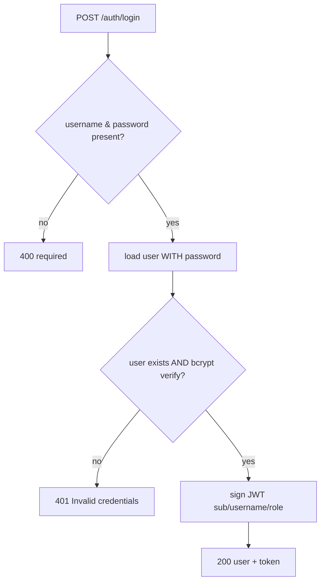

# DUC-USER-LOGIN — Log In

> **Type:** Domain Use Case (DUC)
> **Service:** Gateway (FastAPI port), port 3000
> **Endpoint:** `POST /auth/login`
> **Source of truth:** `backend/gateway/src/routes/auth.routes.js`,
> `backend/gateway/src/services/auth.service.js`
> **Realizes:** [BUC-MATCHING](../../business/startup-investor-matching.md) (AF1),
> [BUC-ADMIN](../../business/admin-dashboard-access.md) (token issuance)

## 1. Description

Authenticates a user by username/password and returns the sanitized user plus a fresh JWT.

## 2. Actors

- **Registered user** (`founder`, `investor`, or a DB-promoted `admin`).
- **Gateway service**, **Postgres** (`users`).

## 3. Preconditions

- The account exists and the password is known.
- `JWT_SECRET` configured.

## 4. Request

`POST /auth/login`, `Content-Type: application/json`. No authentication.

| Field | Type | Required |
|-------|------|----------|
| `username` | string | yes |
| `password` | string | yes |

## 5. Main Flow



1. Validate `username` and `password` are present.
2. Load the user including the password hash (`withPassword` scope).
3. If no such user, or bcrypt verification of the candidate password fails, reject.
4. Issue a JWT identical in shape to registration (`sub`, `username`, `role`).
5. Return `200` with the sanitized user and the token.

**Success response — 200:**
```json
{ "user": { "id": "<uuid>", "username": "...", "role": "investor", ... },
  "token": "<jwt>" }
```

## 6. Alternative Flows

- **AF1 — Admin login:** An account whose role was set to `admin` via database update logs in
  through this same endpoint; the issued JWT carries `role=admin` and unlocks the operational
  dashboard (see [BUC-ADMIN](../../business/admin-dashboard-access.md)). No behavioral branch
  in this DUC — role is simply copied into the token.

## 7. Exception Flows

- **EF1** Missing `username` or `password` → `400 {"error": "username and password are required"}`.
- **EF2** Unknown username **or** wrong password → `401 {"error": "Invalid credentials"}`
  (the two cases are intentionally indistinguishable to avoid user enumeration).

## 8. Business Rules

- **BR1** Authentication is by bcrypt comparison against the stored hash.
- **BR2** Unknown-user and wrong-password both return the same `401` payload (no enumeration).
- **BR3** The issued JWT is HS256/`JWT_SECRET`, carries `sub`/`username`/`role`, and expires
  per `JWT_EXPIRES_IN` (default `1d`).
- **BR4** The response never includes the `password` field.
- **BR5** Login is role-agnostic — founders, investors, and admins use the same endpoint and
  token format; only the `role` claim differs.

## 9. Acceptance Criteria

- **AC1** Correct credentials return `200` with a user (no `password`) and a JWT whose `role`
  matches the stored role.
- **AC2** Missing `username` or `password` returns EF1's exact 400 payload.
- **AC3** A wrong password returns EF2's exact 401 payload.
- **AC4** An unknown username returns the same EF2 401 payload (indistinguishable from AC3).
- **AC5** A user promoted to `admin` in the database receives a token with `role=admin`.

## 10. Cross-References

- Prerequisite: [Register](register.md).
- Token verification: [Get current user](get-current-user.md).
- Dashboard access enabled by admin tokens: [BUC-ADMIN](../../business/admin-dashboard-access.md).
